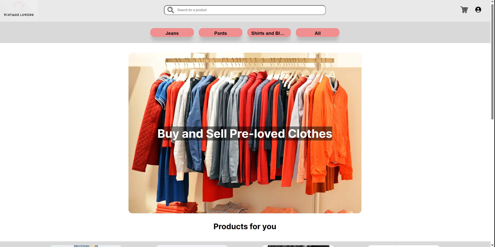

# Vintage Lovers

## Group ltw10g05

- Lucas Faria (up202207540) 33,3%
- Rafael Campeão (up202207553) 33,3%
- Alexandre Lopes (up202207015) 33,3%

## Install Instructions

    git clone <your_repo_url>
    git checkout final-delivery-v1
    sqlite database/database.db < database/database.sql
    sudo apt-get install php-gd (only if you don't have already install it)
    php -S localhost:9000

## External Libraries

We have used the following external libraries:

- php-gd (used to upload and convert the images)

## Screenshots

Screenshots from some of the pages of our website

**All products page**

**Product page**

**Main page**

**Profile page**

## Implemented Features

**General**:

- Register a new account.
- Log in and out.
- Edit their profile, including their name, username, password, and email.

**Sellers**:

- List new items, providing details such as category, brand, model, size, and condition, along with images.
- Track and manage their listed items.
- Respond to inquiries from buyers regarding their items and add further information if needed.
- Print shipping forms for items that have been sold.

**Buyers**:

- Browse items using filters like category, price, and condition.
- Engage with sellers to ask questions or negotiate prices.
- Add items to a wishlist or shopping cart.
- Proceed to checkout with their shopping cart (simulate payment process).

**Admins**:

- Elevate a user to admin status.
- Introduce new item categories, sizes, conditions, and other pertinent entities.
- Oversee and ensure the smooth operation of the entire system (remove/block users, products and other items).

**Security**:
We have been careful with the following security aspects:

- **SQL injection:** using the adequate functions in php PDO (prepare statement)
- **Cross-Site Scripting (XSS):** filtering the inputs give by the user and encoding data we are displaying.
- **Cross-Site Request Forgery (CSRF):** using tokens to check suspicious activity.

**Password Storage Mechanism**: hash_password&verify_password